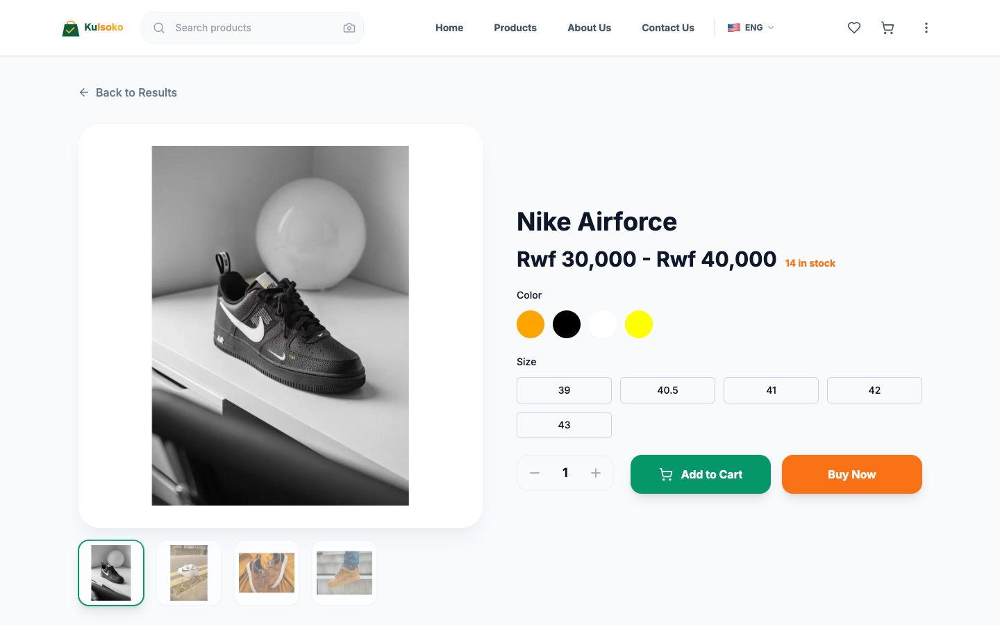
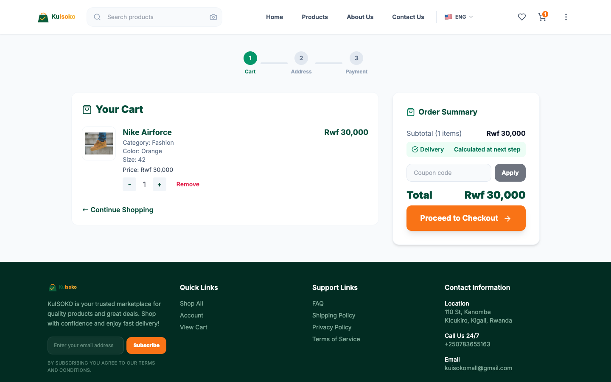
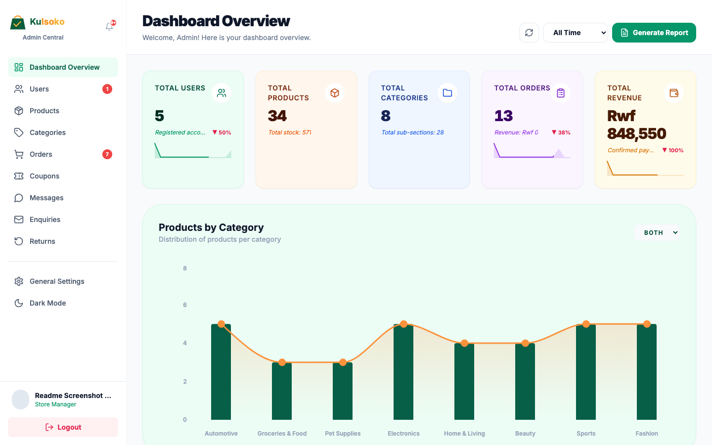
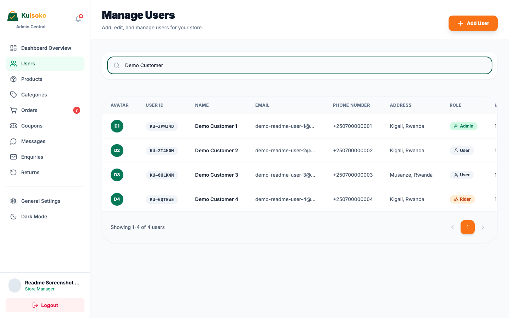

# KuISOKO

KuISOKO is an online marketplace for Rwanda, live at [kuisoko.store](https://kuisoko.store). Customers browse, checkout, and track their orders; admins run the whole store from a dashboard — products, orders, delivery, the works.

I started this as a small MVP and kept building on it: MTN Mobile Money and WhatsApp checkout, a live rider-tracking map for deliveries, group buying with tiered discounts, an in-app chat between customers and support, and a fair bit of security work (2FA, rate limiting, email verification on every order) once real people started actually using it.


## What it does

**For customers:**
- Browse products by category, with color/size variants and a swipeable image + video gallery
- Checkout as a guest or with an account — Cash on Delivery, MTN MoMo, or WhatsApp, with a required email code before any order goes through
- Join a group buy on a product to unlock a better price as more people join
- Chat directly with support, including sending photos or files
- Track a rider's live location once an order is out for delivery
- Sign up with a username (shown on reviews) separate from your login email — and yes, taken usernames get real suggestions, not just an error

**For admins:**
- A dashboard with revenue, order, and product stats
- Full product/category/coupon management, including CSV import
- Order management with rider assignment and reassignment
- Returns and back-in-stock request handling
- Mandatory two-factor authentication on every admin login (this isn't optional — an admin account is too valuable a target to leave behind just a password)



## How it's built

**Backend** — Node.js + Express, PostgreSQL (via `pg`, no ORM), JWT auth, Zod for validation. Emails go through Brevo, payments through MTN MoMo's API, error tracking through Sentry.

**Frontend** — React + TypeScript on Vite, Tailwind for styling, React Router, Leaflet for the delivery map, Recharts for the admin dashboard.

**Hosting** — Railway for both services and the database, Cloudflare for DNS in front of the custom domain.

Migrations live in `backend/db/migrations`, applied in order — `backend/db/schema.sql` is the equivalent from-scratch schema if you're starting a fresh database rather than replaying history.



## Admin panel





## Mobile

Built mobile-first from day one, since most shoppers here are on their phones, not a laptop.


## Running it locally

You'll need Node.js and a local PostgreSQL database.

```bash
git clone https://github.com/hirwachristian/kuisoko.git
cd kuisoko
```

**Backend:**

```bash
cd backend
npm install
cp .env.example .env   # fill in DATABASE_URL, JWT_SECRET, etc.
psql -d your_database -f db/schema.sql
npm run dev             # http://localhost:4000
```

**Frontend** (in a separate terminal):

```bash
cd frontend
npm install
npm run dev             # http://localhost:3000
```

Both directories have a `.env.example` — copy it to `.env` in each (`frontend/.env` only really matters for a production build; local dev falls back to `http://localhost:4000/api` on its own). `DATABASE_URL` and `JWT_SECRET` are the only backend ones you actually need to get the app running — MoMo and Brevo are optional and just get skipped if left blank.

If you're setting up against an already-running production-style database instead of a brand new one, apply the files in `backend/db/migrations/` in numeric order instead of running `schema.sql`.

## Deployment

Both `frontend` and `backend` deploy independently to Railway as separate services, each with its own Dockerfile-free Railway build. There's no CI pipeline wired up yet — deploys are triggered manually via the Railway CLI from each directory.

## A note on the code

This is a working MVP, not a polished open-source library — some patterns repeat across files instead of being pulled into shared helpers, and a few things (mock data in `constants.ts`, some translation strings) are leftovers from earlier iterations that haven't been cleaned up yet. It's in active use, so things move fast here.
